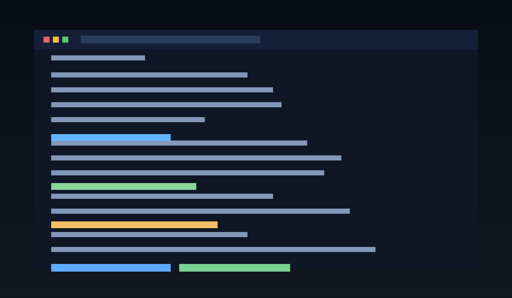
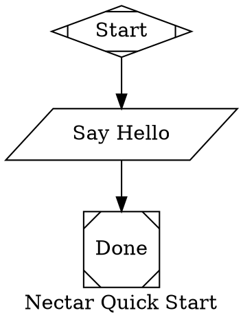

# 🐝 Nectar

> Pollinator CLI for DOT-based pipelines.

[](./LICENSE)

Nectar is a local-first orchestration CLI that runs graph-shaped workflows from `.dot` files. You define petals (nodes), transitions (edges), and runtime behavior in a single graph, then run and resume it from the terminal with themed output and cocoon checkpoints.



## What Is Nectar?

Nectar executes directed graphs as deterministic workflows. It supports scripted nodes, human-in-the-loop gates, retries, restarts, and run persistence, so you can build automations that are inspectable and resilient without requiring a hosted control plane.

## Install

### One-line install (latest release)

```sh
curl -fsSL https://raw.githubusercontent.com/calebmchenry/nectar/main/install.sh | sh
```

### Manual install

1. Download the binary for your platform from [GitHub Releases](https://github.com/calebmchenry/nectar/releases/latest).
2. Download `SHA256SUMS` from the same release.
3. Verify checksum, then place the binary at `~/.local/bin/nectar` (or your preferred location on `PATH`).
4. Mark executable:

```sh
chmod +x ~/.local/bin/nectar
```

### Verify

```sh
nectar --version
```

## Quick Start

Create `gardens/quick-start.dot`:



Run it:

```sh
nectar run gardens/quick-start.dot
```

Example output:

```text
🐝 Nectar buzzing...
🌸 Garden loaded: gardens/quick-start.dot
🌻 Petal [hello] blooming...
✅ sweet success
🍯 Garden pollinated!
```

## Self-Update

Check for updates:

```sh
nectar upgrade --check
```

Install latest release in place:

```sh
nectar upgrade
```

Skip confirmation prompt:

```sh
nectar upgrade --yes
```

## Development

```sh
git clone https://github.com/calebmchenry/nectar.git
cd nectar
npm install
npm run build
npm test
```

Useful install script overrides for local testing:

- `NECTAR_INSTALL_DIR=/custom/bin`
- `NECTAR_RELEASE_BASE_URL=http://127.0.0.1:PORT/download`

## Spec Alignment

- Project intent: [docs/INTENT.md](docs/INTENT.md)
- Attractor spec: <https://github.com/strongdm/attractor/blob/main/attractor-spec.md>

## License

MIT. See [LICENSE](LICENSE).
